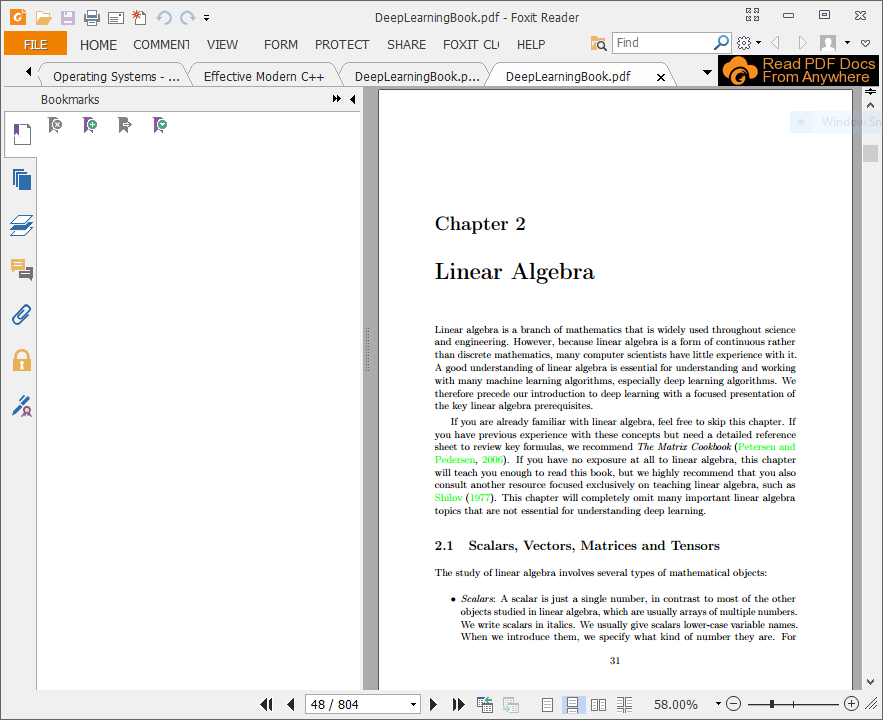
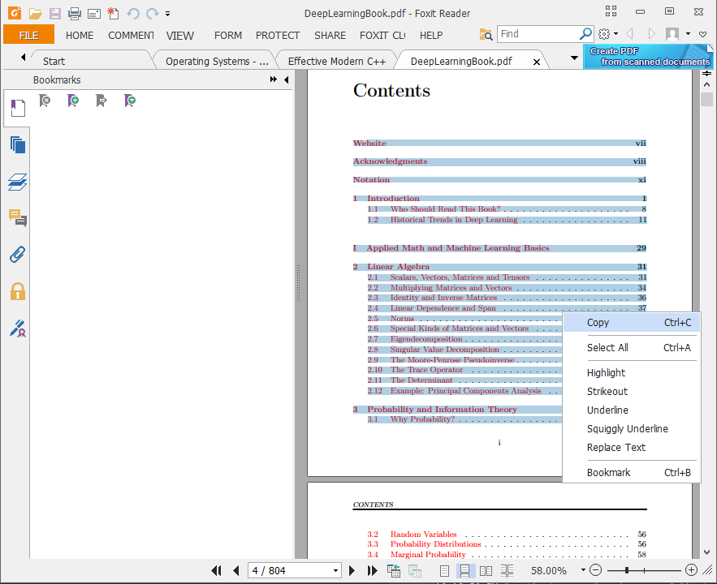
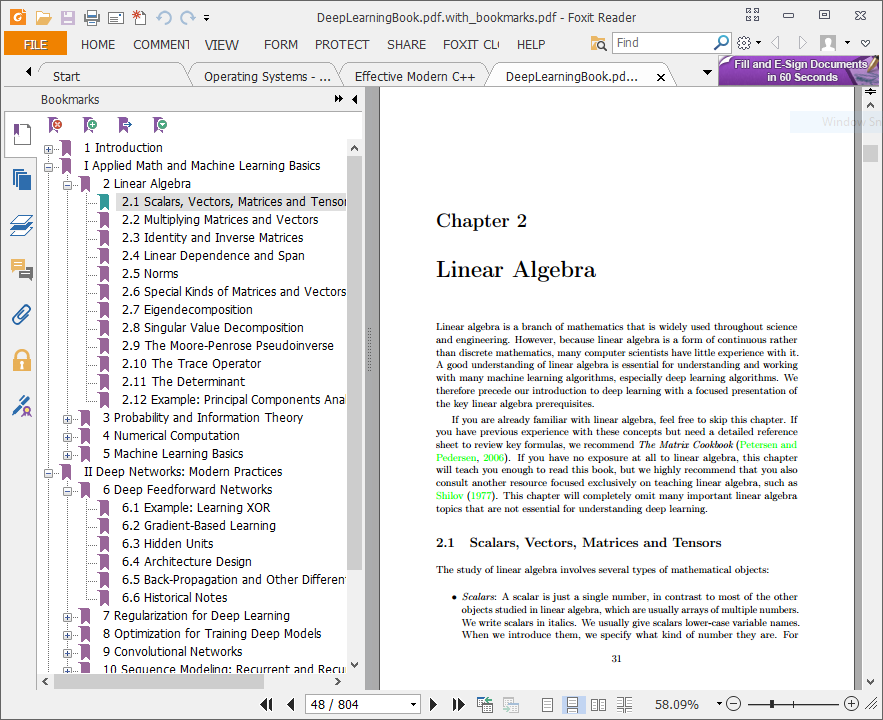

## PDF Auto Bookmarker ##

A simple program for adding bookmarks to pdf books when you have the table of contents in text form.

### Usage ###
The following command does it all
```
java -jar BookmarkMaker.jar <pdf> <bookmark file> <page offset>
```

Will copy the file <pdf> to <pdf>.with_bookmarks.pdf with the included bookmarks.

**&lt;bookmark file&gt;** specifies the bookmarks in text form. An example of proper format is as follows:

```
1 Title 1
 8 SubTitle 1.1
 15 SubTitle 1.2
24 Title 2
 31 SubTitle 2.1
  44 SubSubTitle 2.1.1
  49 SubSubTitle 2.1.2
57 Title 3
```
Each bookmark is on a separate line. The number of spaces at the start of the line is the nesting level of the bookmark.
After the spaces, the page number follows. The remaining text is the title of the bookmark.

**&lt;page offset&gt;** is the offset of what pdf page number corresponds to page 1 in the book.

### Example ###
As an example downloaded the Deep Learning Book pdf from [this repository](https://github.com/HFTrader/DeepLearningBook)
which initially looks as follows:



Copy-paste the text from the table of contents into your favorite text editor to massage it into the necessary format.
I used Sublime Text with multiple cursors to quickly add the starting spaces and regular expression find/replace to move
the page numbers at the beginning of the line and remove the dots. The final text file is included in this repository as
DeepLearningBook-bookmarks.txt.



Then run the following command
```
java -jar BookmarkMaker.jar DeepLearningBook.pdf DeepLearningBook-bookmarks.txt 16
```

And the resulting pdf DeepLearningBook.pdf.with_bookmarks.pdf should have the bookmarks.
